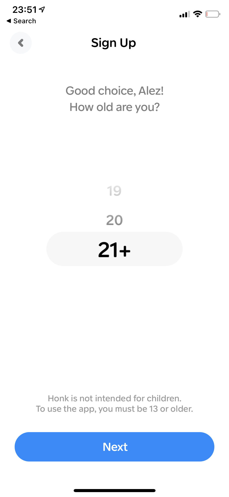
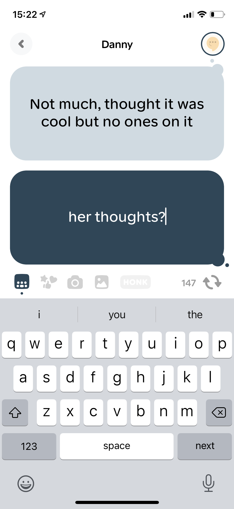

This Christmas, I (25) tried [Honk](https://techcrunch.com/2020/12/23/honk-introduces-a-real-time-ephemeral-messaging-app-aimed-at-gen-z/) with my younger brother, Danny (20). 

I could tell by the smiles on our faces that there is a novelty here, but does Honk have the potential to grow into a well-known messaging app?

When I opened Honk, I quickly sussed I might not be the target audience:

You’re either 13, 14, 15, 16, 17, 18, 19, 20, or a boomer.

Having worked on chat API products like [Pusher Channels](https://pusher.com), [Pusher Chatkit](https://techcrunch.com/2017/11/02/pusher-launches-chatkit/) (sunset in 2020), and [CometChat](https://www.youtube.com/watch?v=8itb64WS6Ic) (TechStars Boulder 19), I have seen customers build similar prototypes. In fact, my friend [Jim Fisher](https://twitter.com/MrJamesFisher) built something similar in 2018 when we worked at Pusher (you can find his prototype on [Heroku](https://jackrobinson.herokuapp.com/)).

Honk differs from its competitors in that it offers a fast-paced, right here, right now experience, even more so than Snapchat. The developers behind Honk are acutely aware of cognitive biases and how to design around them to [*Hook*](https://www.nirandfar.com/hooked/) users. 

One of Snapchat’s most habit-forming design features, which Honk adapted, is the mandatory “Alex is typing…” notifications, which draw you into the app prematurely and even simulate social anxiety when you see someone types but doesn’t send a message. Imagine your crush starts writing but never sends anything. What was it on the tip of their fingers they just couldn't bring themselves to send?
 
Honk takes this further by showing each character as it’s typed, putting the onus on the writer to choose their words carefully and prove their wit in real-time.

You can’t paste, you can’t copy. You can’t screenshot without the other person knowing about it. Together, these design features lower inhibitions to write what you’re thinking and send more messages in a session.

It’s fun, and the user experience is world-class. The interface looks clean and mature, but there are playful, unique animations around every corner. Sound design is not something I would normally associate with an app in this category, but the interaction sounds are intentional and charming. 

To me, a HONK is reminiscent of a nudge on MSN, but it also feels totally refreshed. I should probably grow up, but it’s fun to wind my brother up by honking him all the time. I find it hard to imagine how the intended audience will HONK their friends - hopefully, Honk will live long enough to find out.

## Why Honk might not work

I asked my brother (20) what his girlfriend made of Honk. What she said isn’t surprising:

Honk’s biggest hurdle is the cold start: You have no one to engage with when you start. 

Only allowing you to login with your phone number or iCloud is conducive to accessing contacts, but as a growth tactic, this won't take Honk far in the grand scheme of things.

I can’t remember who wrote it first, but I agree with the sentiment that a product needs to be *three-times* as good as the competition (something like that) to propel users to switch. Honk could be a better mousetrap, but that is not enough to thrive in this market.

Another threat is that there aren’t many reasons to come back to Honk. Snapchat has lightweight game dynamics like streaks 🔥. Messenger stores your message history and photos. Those are examples of the **endowment effect** - you *invest* content on the platform now it’s harder to switch. On Honk, aside from your contacts, everything is ephemeral.

Also, people want to look good and see things they like. Snapchat has filters and stories to flex in (in fact, stories were pioneered by Snapchat, and arguably, the chat is a secondary feature for them). Conversely, it’s actually kind of easy to look stupid or embarrass yourself if you tell your crush you fancy them on Honk before deleting the message. Not everyone is quick-witted.

## Why Honk might work

Honk’s biggest hurdle is also their biggest opportunity: Network effects - the more people on the app, the more valuable the app becomes. The bigger you get, the stronger the network effects are, and there is virtually no ceiling!

Honk does not support videos, group chats, or audio - frankly, I can’t imagine how group chats would work without being totally hectic. Maybe none of this matters.

Push notifications bridge the gap between chat applications and the phone's operating system, allowing users to parse all their messages from the notification center, regardless of which app the message originated from. WhatsApp and Messenger (to name just two examples) allow you to *respond* from the home screen too.

This isn’t conducive to apps like Snapchat or Honk, where you’re not meant to read the message until you open the app.

Not unlike pulling a slot machine, now there’s an element of **variability** each time you open the app - you don’t know what you’re going to get, and it’s addicting. Because read receipts are now dependable, you can’t pretend you haven’t seen the message - you are **pressured** to respond now; otherwise, risk upsetting the sender. Poor kids.

How many messaging apps do you have on your phone?

It's normal to use multiple messaging apps - from the built-in ones to Messenger, Snapchat, dating apps like Hinge, or annonymous messaging apps like Wickr 🍃💨. This isn't a winner-takes-all market. 

Maybe Honk is where you take the conversation when you want an authentic answer? If you’re over 18, it actually looks like a pretty fun way to text someone you matched with on a dating app - that could be a likely pivot for Honk.

Honk has some pretty exciting growth opportunities, too. I learned about Honk on Twitter, but I do not represent the target audience. The target audience is Gen Z, which - go figure - also hangout on TikTok where Honk is trying their best to go viral, bless them. They have 150K likes, but who can say how that translates to app installs on an app like TikTok.

They should keep going! 

At the moment, Honk only has an iOS app. 

When Casey Neistat launched [Beme](https://www.youtube.com/watch?v=kqJNQevSgP8) on iOS, an army of would-be users awaiting the Android release attributed Beme's demise to a lack of platform support. This is not a well-researched article (team Beme likely said plenty about this), but I very much doubt that to be true. If you have product-market fit, that part takes care of itself. I respect Honk for focusing on delivering an awesome iOS experience. While the lack of platform support makes adding your friends challenging, pent-up demand is a good problem. Keep up the good work, team Honk!

## Conclusion

I don't know much about who is building Honk or what they are trying to achieve. 

Entering this market without a niche audience is audiacious. There’s a small chance you go viral with high retention; else, you’re destined to pivot, pivot, pivot until you find product-market fit (or die). Maybe then you can broaden your offering and audience.

I expect the team behind Honk have many exciting ideas, and I am looking forward to watching them unfold.

For the investors, this represents a high risk, high reward opportunity. Lest we forget, Facebook offered to buy Snapchat for 3 BILLION dollars.

**✨ Since you read this far, you should [follow @bookercodes Twitter](https://twitter.com/bookercodes)**
