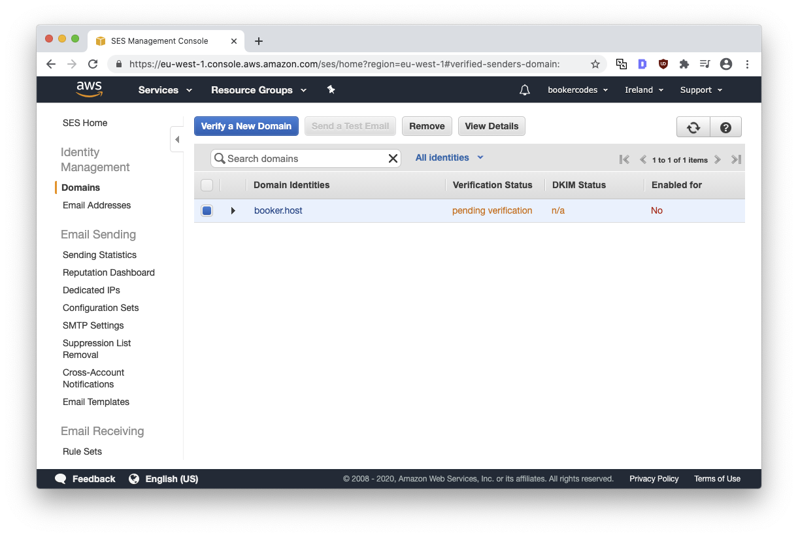
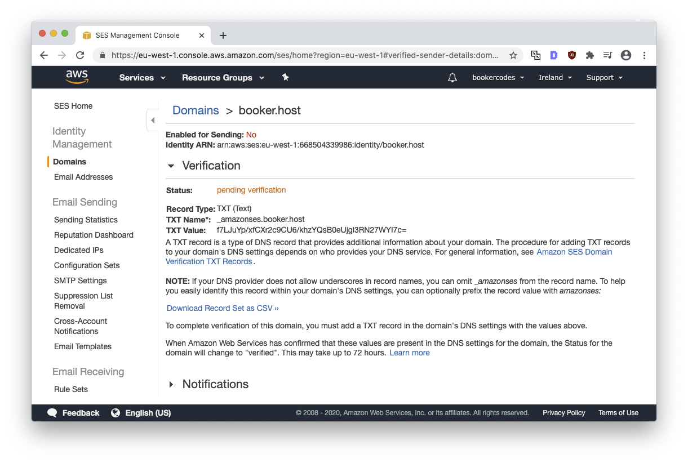
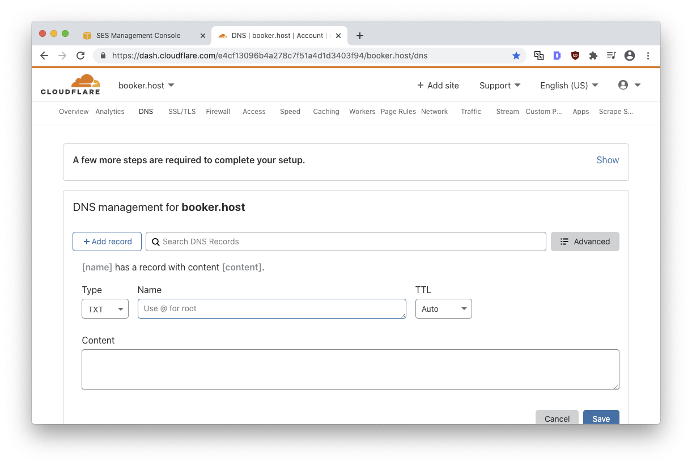

> _TL;DR: If you've arrived at this post, I reccomend removing then readding your domain from the SES Management Console. You can refer to screenshot #3 to see an example of a working DNS configuration. On macOS or Linux, run `nslookup -type=TXT YOURDOMAIN.COM` to verify your DNS has propagated and the values match those AWS provided. If you don't see the values you expect, best double-check them now.  If you don't get a meaningful response, I have some advice in the [DNS propogation](#dns-propogtion) section of this post._

Before sending or receiving emails through Amazon's Simple Email Service (SES) you’ll need to verify a domain. Although AWS mention verification “may take up to 72 hours” in most cases, it ought to only take a few minutes. Trouble arises when you attempt to verify a domain and nothing happens - you get stuck in this sorta “pending verification” purgotory with no feedback as to when it'll end!



After pending verification for more than 60 minutes I was left woundering if I'd done something wrong. Maybe I just needed to be patient and wait until tomorrow morning and up to 72 hours? Hope not!
 
Armed with a basic understanding of how a DNS works and access to a macOS or Linux command-line, I can show you how to verify that your domain is configured correctly and advise when you might actually need to just be patient and wait.

## Solving common problems

If you’ve arrived at this post, I recommend starting from the beginning. From the SES Management Console, **Remove** the domain then  click **Verify a New Domain** to readd.

This will give you a fresh perspective, sure, but more importantly, AWS imply (in a [screencast](https://youtu.be/aIxYcpZ4Op0)) that SES checks your host records less frequently as time goes by (exponential backoff). Starting from scratch ensures SES checks your host records promptly.

One reason I felt a little confused is that AWS instruct me to set the **TXT name** field to `_amazonses.booker.host`:



But my DNS, [CloudFlare](https://cloudflare.com/), doesn’t have a **TXT name field**. As I later learned, their equivalent field is labelled **Name**: 



That was a little embarassing to write but heindsight is 20/20!

Moreover, when I entered the value, `_amazonses.booker.codes`, CloudFlare silently removed the `_amazonses.` part which made me feel like maybe it wouldn’t work. Turns out the `_amazonses.` part is kinda like a namespace and completely optional. 

One last gotcha is sneaky line breaks and spaces. When I pasted the **TXT value** from AWS, I noticed a naughty line break appear. I'm not sure AWS will accept the value if it contains superflous line breaks or spaces so best to eliminate them.

Hit **Save** and wait a few minutes (normally between 3 and 5) before refreshing your domain list in the SES Management Console.

Writing this short post with the benefit of hindsight, I'm sure that if your CloudFlare (or equivalent) DNS configuration looks like my screenshots and you restart the domain verifiation process for good measure, AWS will graduate you from pending verification purgory in no time. But what if you're _still_ pending verification?

## DNS propogtion

When you update your DNS, it will take a little while for the changes to be updated across the internet (a process called DNS propogation). In certain cases, especially where caching is involved, this can take a while - maybe up to 72 hours, according to AWS. 

To test if your DNS has propagated, open the command-line and run the `nslookup` command, making sure to replace `YOURDOMAIN.COM` with your domain:
```text
nslookup -type=TXT YOURDOMAIN.COM
```

For completeness, here's the response I see, featuring the expected TXT values highlighted 6 lines down:
```text/5-5
booker@macbook ~ % nslookup -type=TXT booker.host
Server:		193.138.218.74
Address:	193.138.218.74#53

Non-authoritative answer:
booker.host	text = "f7LJuYp/xfCXr2c9CU6/khzYQsB0eUjgl3RN27WYI7c="

Authoritative answers can be found from:
booker.host	nameserver = reza.ns.cloudflare.com.
booker.host	nameserver = conrad.ns.cloudflare.com.
reza.ns.cloudflare.com	internet address = 172.64.32.217
reza.ns.cloudflare.com	internet address = 173.245.58.217
reza.ns.cloudflare.com	internet address = 108.162.192.217
reza.ns.cloudflare.com	has AAAA address 2a06:98c1:50::ac40:20d9
reza.ns.cloudflare.com	has AAAA address 2606:4700:50::adf5:3ad9
reza.ns.cloudflare.com	has AAAA address 2803:f800:50::6ca2:c0d9
conrad.ns.cloudflare.com	internet address = 108.162.195.146
conrad.ns.cloudflare.com	internet address = 162.159.44.146
conrad.ns.cloudflare.com	internet address = 172.64.35.146
conrad.ns.cloudflare.com	has AAAA address 2803:f800:50::6ca2:c392
conrad.ns.cloudflare.com	has AAAA address 2a06:98c1:50::ac40:2392
conrad.ns.cloudflare.com	has AAAA address 2606:4700:58::a29f:2c92
```

If you see something like `YOURDOMAIN.COM text = "f7LJuYp/xfCXr2c9CU6/khzYQsB0eUjgl3RN27WYI7c="`, you can be sure AWS will also see the value next time they check. If you don't yet see your record, you may need to be patient. 

Most likely, your DNS has not yet propogated the changes. Perhaps because the host's time to live (TTL) has not yet expired. 

Alternatively, it may be that your machine's local DNS is caching a previous DNS response and you need to [flush your local DNS cache](https://lmgtfy.app/?q=how+to+flush+dns+cache+macos+catalina). I've been woundering if there's a `nslookup` flag to invalidate the cache but I haven't looked into it. Perhaps that would violate the age-old Unix wisdom, “do one thing and do it well”.